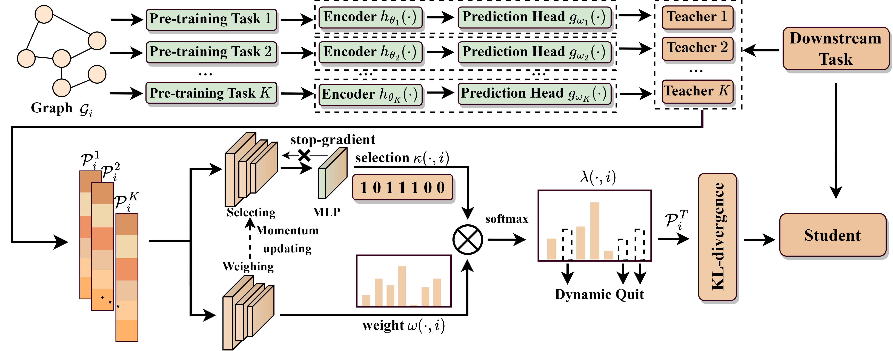

# WAS
Code for ICLR'24 Paper "Decoupling Weighing and Selecting for Integrating Multiple Graph Pre-training Tasks" 

[[paper]](https://openreview.net/forum?id=c85tdYOOju)


### Introduction
Recent years have witnessed the great success of graph pre-training for graph representation learning. With hundreds of graph pre-training tasks proposed, integrating knowledge acquired from multiple pre-training tasks has become a popular research topic. In this paper, we identify two important collaborative processes for this topic: (1) select: how to select an optimal task combination from a given task pool based on their compatibility, and (2) weigh: how to weigh the selected tasks based on their importance. While there currently has been a lot of work focused on weighing, comparatively little effort has been devoted to selecting. This paper proposes a novel instance-level framework for integrating multiple graph pre-training tasks,
Weigh And Select (WAS), where the two collaborative processes, weighing and selecting, are combined by decoupled siamese networks. Specifically, it first adaptively learns an optimal combination of tasks for each instance from a given task pool, based on which a customized instance-level task weighing strategy is learned. Extensive experiments on 16 graph datasets across node-level and graph-level downstream tasks have demonstrated that by combining a few simple but classical tasks, WAS can achieve comparable performance to other leading counterparts.

<p align="center">
  
</p>

---

### Dependencies
```
conda env create -f environment.yml
conda activate WAS
```

---

### Dataset
#### Graph-level

At graph-level, we follow exactly a previous awesome work - [GraphMVP](https://chao1224.github.io/GraphMVP), and use their open source code. **Thanks for their amazing work!**

Please turn to `./graph-level/prepare` to prepare your pre-training and fine-tuning datasets. Also use the code to prepare your own teacher models.

#### Node-level

Node-level datasets will be downloaded automatically during training. Use `--dataset` to specify dataset.
The downloaded datasets will be put under  `./data/{datasets}`

---
### Use WAS
#### Graph-level
After preparing your teacher model, put them under `./graph-level/teachers/{teacher model}` and put your datasets under `./molecule_datasets/{datasets}`.
Then run the following code to train student model:
```
cd ./graph-level
python train.py --dataset {dataset}
```

The student model will be stored in `./graph-level/student/student_model_on_{dataset}.pth`

#### Node-level
At node-level, teacher models will be trained automately before training student model.
Run the following code to train student model:
```
cd ./node-level
python train.py --dataset {dataset}
```


